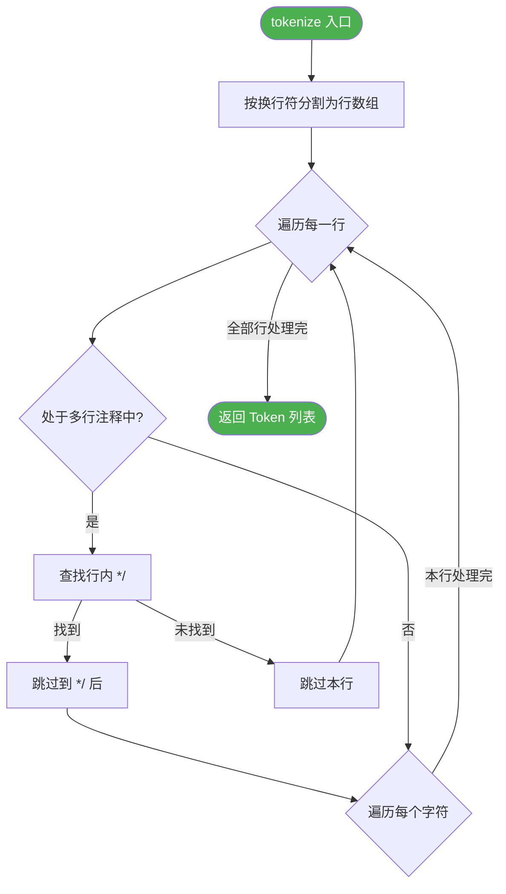
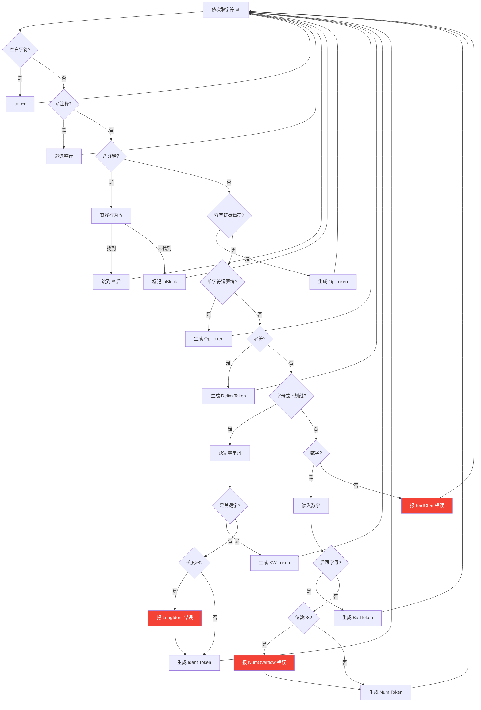
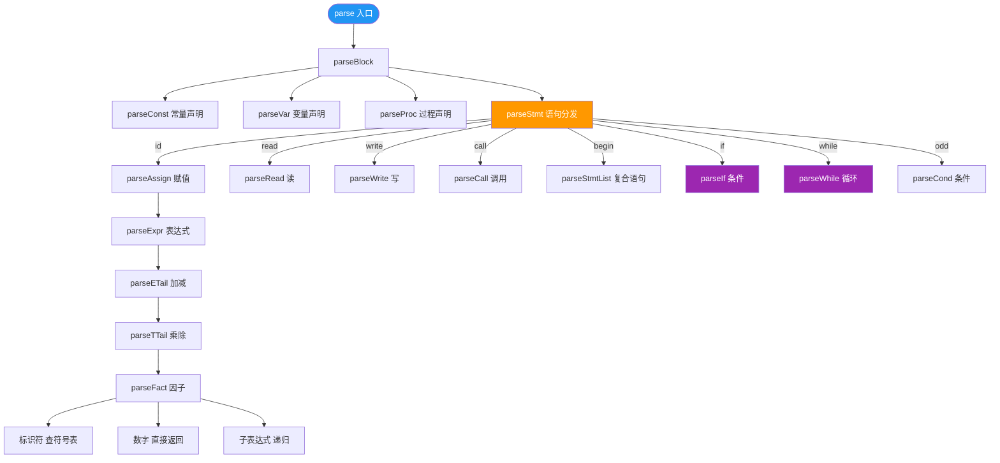
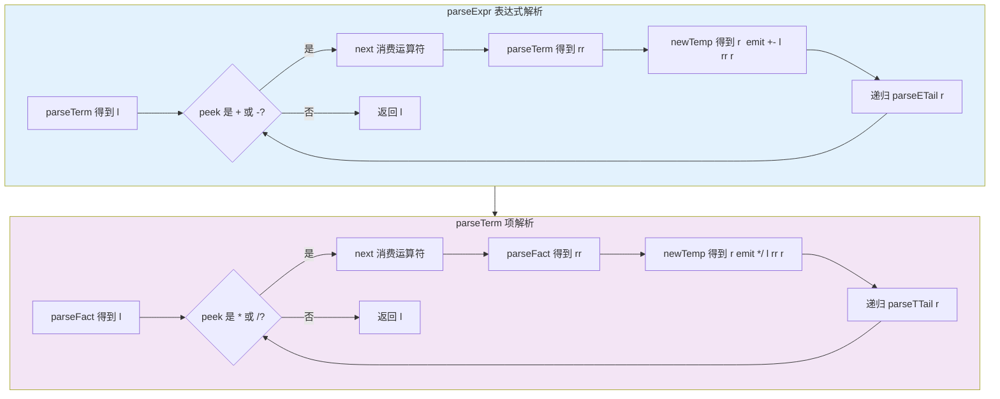
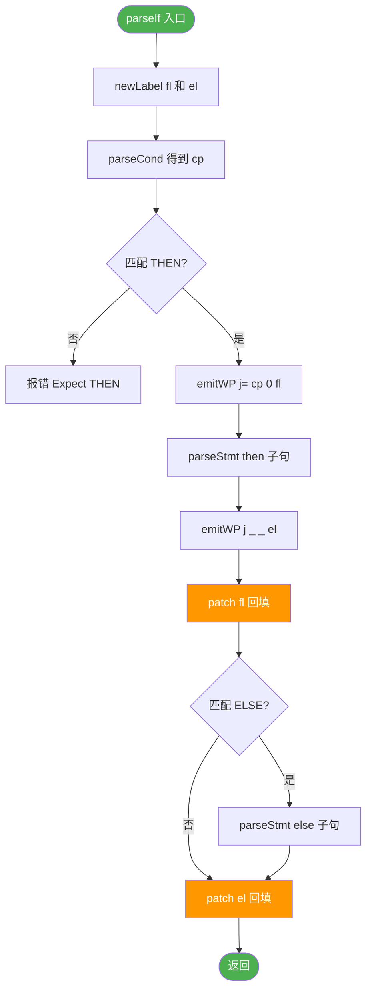
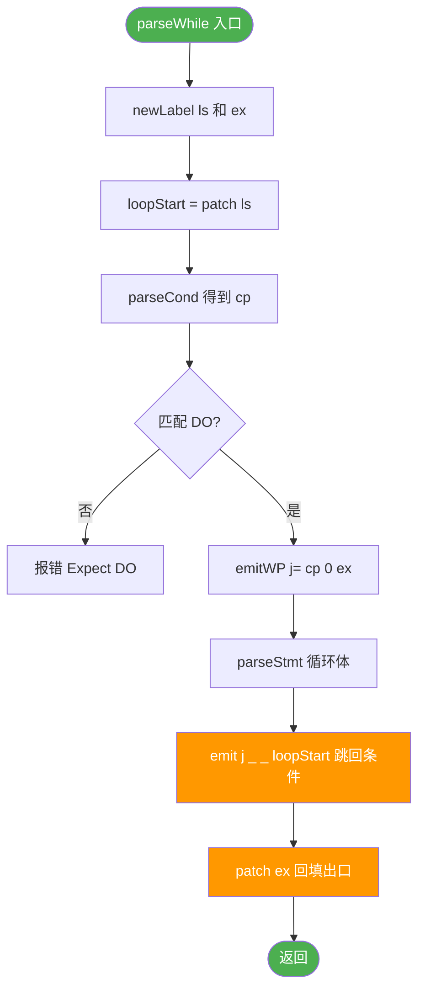
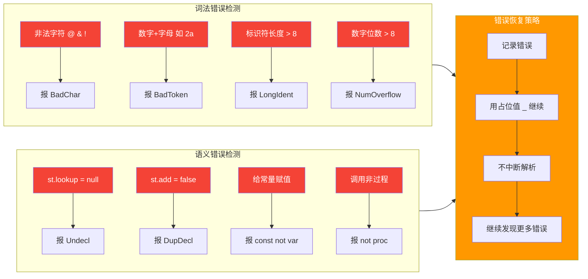

# 设计流程图

> 项目：PL0_SemanticAnalyzer_STranslation  
> 以下使用 Mermaid 语法绘制（在支持 Mermaid 的 Markdown 编辑器中可直接渲染）

---

## 1. 总体架构流程


---

## 2. 词法分析流程图

> 分两段展示：主循环 和 字符分类

### 2.1 主循环 + 注释处理



### 2.2 字符分类识别



---

## 3. 递归下降语法分析流程图

### 3.1 总体解析树



### 3.2 表达式解析流程（消除左递归）



### 3.3 条件语句 if-then-else 流程



### 3.4 循环语句 while-do 流程



---

## 4. 四元式回填流程图

```mermaid
flowchart TD
    subgraph emitWP[emitWP 阶段 延迟绑定]
        direction TB
        S1[遇到控制流 if / while] --> S2[newLabel 得到 $N]
        S2 --> S3[emit op a1 a2 $N result 暂填标签名]
        S3 --> S4[pending[$N].add(idx) 记录待回填编号]
    end
    
    subgraph patch[patch 阶段 地址回填]
        direction TB
        P1[确定目标 pos = quadCount + 1] --> P2[从 pending 取出 label 对应的 idx]
        P2 --> P3{FOR 每个 idx}
        P3 -->|idx = 5| F5[quads[4].result = pos]
        P3 -->|idx = 12| F12[quads[11].result = pos]
        F5 --> P3
        F12 --> P3
        P3 -->|全部完成| P4[pending.remove(label)]
    end
    
    emitWP -.->|延迟绑定| patch

    style emitWP fill:#E3F2FD
    style patch fill:#F3E5F5
    style F5 fill:#FF9800,color:#fff
    style F12 fill:#FF9800,color:#fff
```

### 回填示例：if-then-else

```
源代码:  if a <= 10 then c := b + a else c := 0

四元式生成过程:
(1) syss
(2) <= a 10 T1
(3) j= T1 0 $1       <- emitWP: 条件为假时跳 $1
(4) + b a T2
(5) := T2 _ c
(6) j _ _ $2          <- emitWP: then 结束后跳 $2
    -> patch($1): 将 $1 回填为 7  <- $1 = 当前位置
(7) = 0 _ c
    -> patch($2): 将 $2 回填为 8  <- $2 = 当前位置
(8) syse
```

---

## 5. 符号表管理流程图

```mermaid
flowchart TD
    subgraph Scope[作用域管理]
        direction LR
        EN[enterScope push 新 HashMap] --> Use[执行 parseBlock]
        Use --> EX[exitScope pop 当前 HashMap]
    end
    
    subgraph Add[符号添加]
        A[add name kind value] --> CK{当前作用域已有同名符号?}
        CK -->|有| RF[返回 false 重复声明]
        CK -->|无| AS[创建 Symbol 加入当前作用域]
        AS --> RT[返回 true]
    end
    
    subgraph Lookup[符号查找]
        L[lookup name] --> LS{FOR i 从 scope深度-1 到 0}
        LS -->|当前层| FD{scopes[i] 包含 name?}
        FD -->|是| RTN[返回 Symbol]
        FD -->|否| LS
        LS -->|全部查完| RNULL[返回 null 未声明]
    end
    
    EN --> Add
    Add --> Lookup

    style EN fill:#4CAF50,color:#fff
    style EX fill:#f44336,color:#fff
    style RF fill:#f44336,color:#fff
    style RNULL fill:#f44336,color:#fff
```

---

## 6. 错误处理流程



---

## 7. 主控流程

```mermaid
flowchart TD
    Main([Main.main]) --> Args{args 长度?}
    
    Args -->|0| Examples[runExamples 运行内置示例]
    Args -->|其他| File{args[0] 是目录?}
    
    File -->|是| Batch[batch 遍历目录下所有 .pl0]
    File -->|否| Single[file 分析单个 .pl0 文件]
    
    Examples --> Ex1[示例1: 正确程序]
    Examples --> Ex2[示例2: 语义错误]
    
    Single --> Read[ReadFile 得到 code]
    Read --> Lex[new Lexer 得到 tokens]
    Lex --> Par[new LR1Parser 得到 quads + symtbl + errs]
    Par --> Output[输出结果]
    
    Batch --> Files[遍历 .pl0 文件]
    Files --> Single

    style Main fill:#2196F3,color:#fff
    style Examples fill:#4CAF50,color:#fff
    style Single fill:#FF9800,color:#fff
    style Batch fill:#9C27B0,color:#fff
---

## 文档说明

以上流程图使用 **Mermaid** 语法绘制。在以下环境中可直接渲染查看：

| 环境 | 渲染方式 |
|------|---------|
| GitHub / GitLab | 直接支持 Mermaid 渲染 |
| VS Code | 安装 Markdown Preview Mermaid Support 插件 |
| Typora | 原生支持 |
| Obsidian | 安装 Mermaid 插件 |
| JetBrains IDE | 安装 Markdown 插件 |

> 如果某个流程图仍然无法加载，可以单独复制代码块到 https://mermaid.live 查看。
