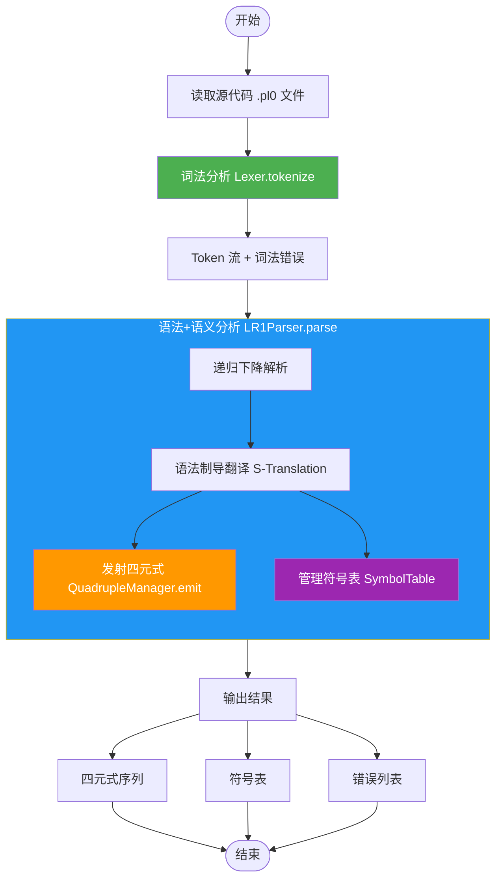
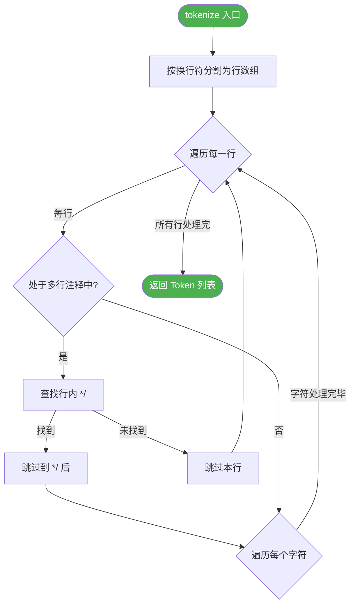
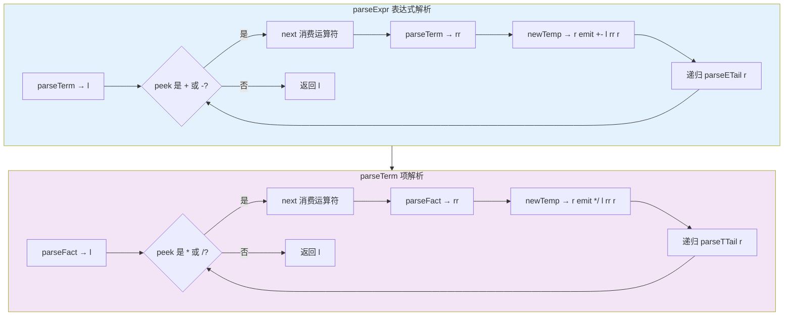
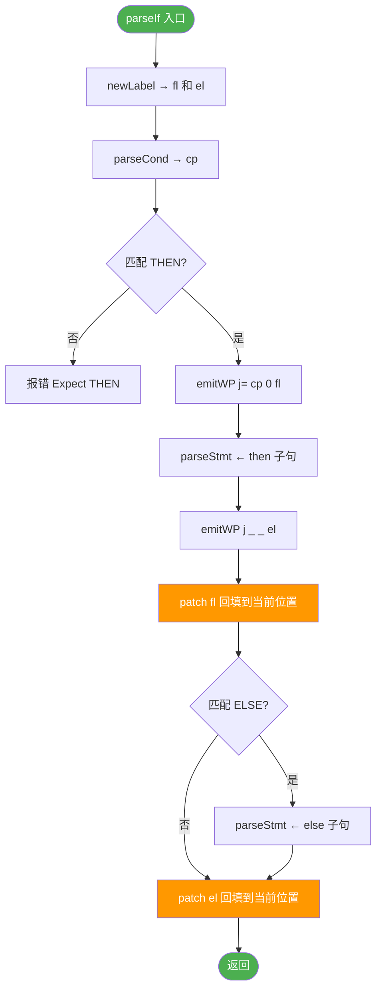
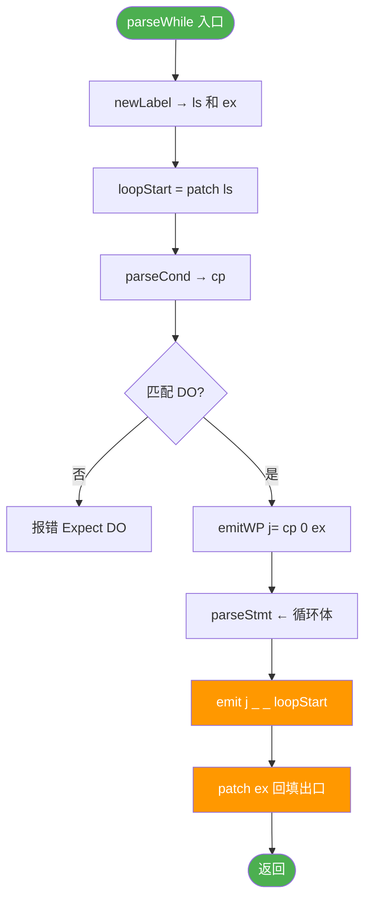
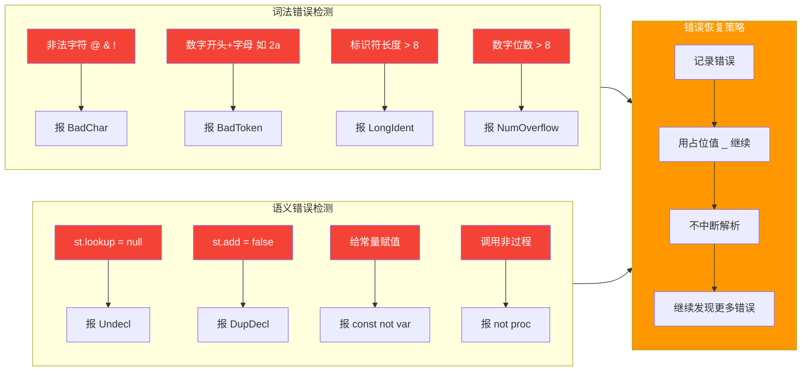

# 设计流程图

> 项目：PL0_SemanticAnalyzer_STranslation  
> 以下使用 Mermaid 绘制真实流程图（在支持 Mermaid 的 Markdown 编辑器中可直接渲染）

---

## 1. 总体架构流程



---

## 2. 词法分析流程图

> 分两段展示：主循环 和 字符分类

### 2.1 主循环 + 注释处理



### 2.2 字符分类识别

```mermaid
flowchart TD
    ColLoop[依次取字符 ch] --> IsWS{空白字符?}
    IsWS -->|是| NextWS[col++] --> ColLoop
    
    IsWS -->|否| IsLineComment{// 注释?}
    IsLineComment -->|是| SkipLine[跳过整行] --> Loop
    
    IsLineComment -->|否| IsBlockComment{/* 注释?}
    IsBlockComment -->|是| FindBlockEnd[查找行内 */]
    FindBlockEnd -->|找到| AfterBlock[跳到 */ 后] --> ColLoop
    FindBlockEnd -->|未找到| SetInBlock[标记 inBlock] --> Loop
    
    IsBlockComment -->|否| Is2Op{双字符运算符? := <= >=}
    Is2Op -->|是| Emit2Op[生成 Op Token] --> ColLoop
    
    Is2Op -->|否| Is1Op{单字符运算符? + - * / = # < >}
    Is1Op -->|是| Emit1Op[生成 Op Token] --> ColLoop
    
    Is1Op -->|否| IsDelim{界符? ( ) ; , .}
    IsDelim -->|是| EmitDelim[生成 Delim Token] --> ColLoop
    
    IsDelim -->|否| IsLetter{字母或下划线?}
    IsLetter -->|是| ReadWord[读完整单词]
    ReadWord --> IsKW{是关键字?}
    IsKW -->|是| EmitKW[生成 KW Token] --> ColLoop
    IsKW -->|否| CheckLen{长度>8?}
    CheckLen -->|是| ErrLong[报 LongIdent 错误]
    CheckLen -->|否| EmitIdent[生成 Ident Token] --> ColLoop
    ErrLong --> EmitIdent
    
    IsLetter -->|否| IsDigit{数字?}
    IsDigit -->|是| ReadNum[读入数字]
    ReadNum --> NumLetter{后跟字母? 如 2a}
    NumLetter -->|是| EmitBad[生成 BadToken] --> ColLoop
    NumLetter -->|否| NumLen{位数>8?}
    NumLen -->|是| ErrOverflow[报 NumOverflow 错误]
    NumLen -->|否| EmitNum[生成 Num Token] --> ColLoop
    ErrOverflow --> EmitNum
    
    IsDigit -->|否| ErrChar[报 BadChar 错误] --> ColLoop

    style ErrChar fill:#f44336,color:#fff
    style ErrLong fill:#f44336,color:#fff
    style ErrOverflow fill:#f44336,color:#fff
```

---

## 3. 递归下降语法分析流程图

### 3.1 总体解析树

```mermaid
flowchart TD
    P([parse 入口]) --> PB[parseBlock]
    
    PB --> PC[parseConst<br/>常量声明]
    PB --> PV[parseVar<br/>变量声明]
    PB --> PP[parseProc<br/>过程声明]
    PB --> PS[parseStmt<br/>语句分发]
    
    PS --> PA[parseAssign 赋值]
    PS --> PR[parseRead 读]
    PS --> PW[parseWrite 写]
    PS --> PCALL[parseCall 调用]
    PS --> PCOMP[parseStmtList 复合语句]
    PS --> PIF[parseIf 条件]
    PS --> PWHILE[parseWhile 循环]
    PS --> PCOND[parseCond 条件]

    PA --> Expr[parseExpr 表达式]
    Expr --> ET[parseETail +/-]
    ET --> T[parseTTail *//]
    T --> F[parseFact 因子]
    F --> Fid[标识符 → st.lookup]
    F --> Fnum[数字 → 直接返回]
    F --> Fparen[子表达式 ( ]

    style P fill:#2196F3,color:#fff
    style PS fill:#FF9800,color:#fff
    style PIF fill:#9C27B0,color:#fff
    style PWHILE fill:#9C27B0,color:#fff
```

### 3.2 表达式解析流程（消除左递归）



### 3.3 条件语句 if-then-else 流程



### 3.4 循环语句 while-do 流程



---

## 4. 四元式回填流程图

```mermaid
flowchart TD
    subgraph emitWP[emitWP 阶段 延迟绑定]
        direction TB
        WP1[遇到控制流语句 if / while] --> WP2[newLabel → $N]
        WP2 --> WP3[emit op a1 a2 $N  result暂填标签名]
        WP3 --> WP4[pending[$N].add(idx) 记录待回填编号]
    end
    
    subgraph patch[patch 阶段 地址回填]
        direction TB
        P1[确定目标位置 pos = quadCount + 1] --> P2[从 pending 取出 label 对应的 idx 列表]
        P2 --> P3{FOR 每个 idx}
        P3 -->|idx = 5| Fill5[quads[4].result = pos]
        P3 -->|idx = 12| Fill12[quads[11].result = pos]
        Fill5 --> P3
        Fill12 --> P3
        P3 -->|全部完成| P4[pending.remove(label)]
    end
    
    emitWP -.->|延迟绑定| patch

    style emitWP fill:#E3F2FD
    style patch fill:#F3E5F5
    style Fill5 fill:#FF9800,color:#fff
    style Fill12 fill:#FF9800,color:#fff
```

### 回填示例：if-then-else

```
源代码:  if a <= 10 then c := b + a else c := 0

四元式生成过程:
(1) syss
(2) <= a 10 T1
(3) j= T1 0 $1       ← emitWP: 条件为假时跳 $1
(4) + b a T2
(5) := T2 _ c
(6) j _ _ $2          ← emitWP: then 结束后跳 $2
    → patch($1): 将 $1 回填为 7  ← $1 = 当前位置
(7) = 0 _ c
    → patch($2): 将 $2 回填为 8  ← $2 = 当前位置
(8) syse
```

---

## 5. 符号表管理流程图

```mermaid
flowchart TD
    subgraph Scope[作用域管理]
        direction LR
        Enter[enterScope push 新 HashMap] --> Use[在作用域内 执行parseBlock]
        Use --> Exit[exitScope pop 当前 HashMap]
    end
    
    subgraph Add[符号添加]
        A[add name kind value] --> Check{当前作用域已有同名符号?}
        Check -->|有| RetFalse[返回 false 重复声明]
        Check -->|无| AddSym[创建 Symbol 加入当前作用域和全局列表]
        AddSym --> RetTrue[返回 true]
    end
    
    subgraph Lookup[符号查找]
        L[lookup name] --> LoopScope{FOR i = scope深度-1 DOWNTO 0}
        LoopScope -->|当前层| Find{scopes[i] 包含 name?}
        Find -->|是| Return[返回 Symbol]
        Find -->|否| LoopScope
        LoopScope -->|全部查完| RetNull[返回 null 未声明]
    end
    
    Enter --> Add
    Add --> Lookup

    style Enter fill:#4CAF50,color:#fff
    style Exit fill:#f44336,color:#fff
    style RetFalse fill:#f44336,color:#fff
    style RetNull fill:#f44336,color:#fff
```

---

## 6. 错误处理流程



---

## 7. 主控流程

```mermaid
flowchart TD
    Main([Main.main]) --> Args{args 长度?}
    
    Args -->|0| Examples[runExamples 运行内置示例]
    Args -->|>0| File{args[0] 是目录?}
    
    File -->|是| Batch[batch 遍历目录下所有 .pl0]
    File -->|否| Single[file 分析单个 .pl0 文件]
    
    Examples --> Ex1[示例1: 正确程序]
    Examples --> Ex2[示例2: 语义错误]
    
    Single --> Read[ReadFile  String code]
    Read --> Lex[new Lexer  tokenize  tokens]
    Lex --> Par[new LR1Parser  parse]
    Par --> Output[输出四元式 + 符号表 + 错误]
    
    Batch --> Files[遍历 .pl0 文件]
    Files --> Single

    style Main fill:#2196F3,color:#fff
    style Examples fill:#4CAF50,color:#fff
    style Single fill:#FF9800,color:#fff
    style Batch fill:#9C27B0,color:#fff
```

---

## 文档说明

以上流程图使用 **Mermaid** 语法绘制。在以下环境中可直接渲染查看：

| 环境 | 渲染方式 |
|------|---------|
| GitHub / GitLab | 直接支持 Mermaid 渲染 |
| VS Code | 安装 Markdown Preview Mermaid Support 插件 |
| Typora | 原生支持 |
| Obsidian | 安装 Mermaid 插件 |
| JetBrains IDE | 安装 Markdown 插件 |

### VS Code 推荐插件

- **Markdown Preview Mermaid Support**（bierner.github.markdown-preview）
- 安装后重启 VS Code，打开 Markdown 预览即可渲染

> 如果某个流程图仍然无法加载，可能是渲染引擎限制。可以单独打开该代码块复制到 https://mermaid.live 查看。
