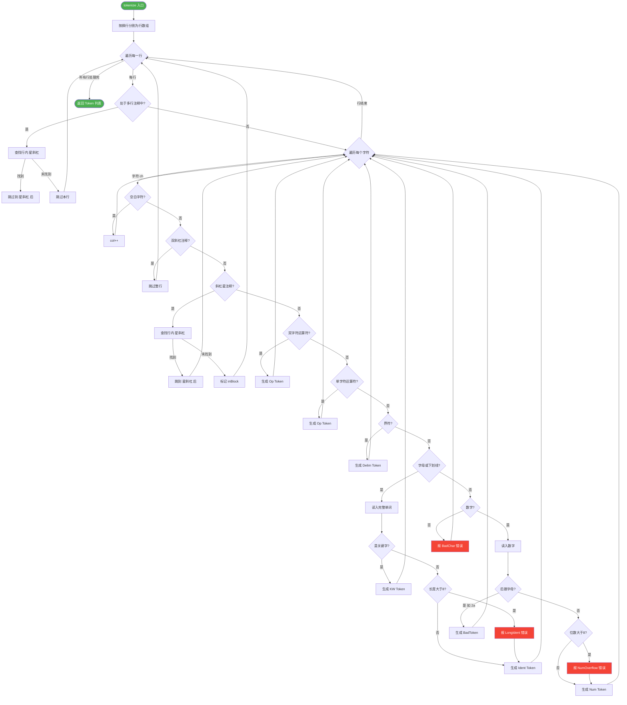
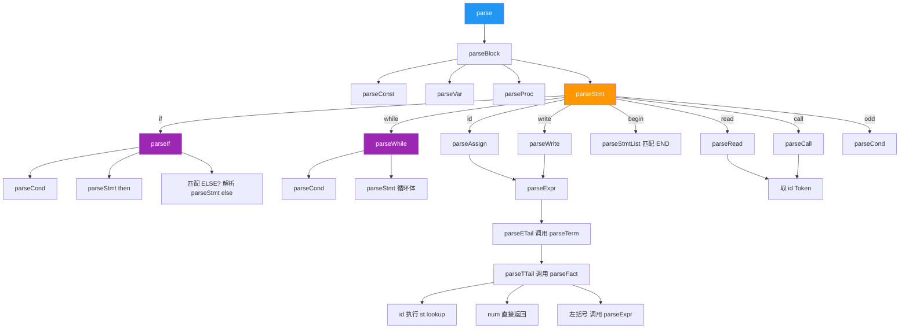
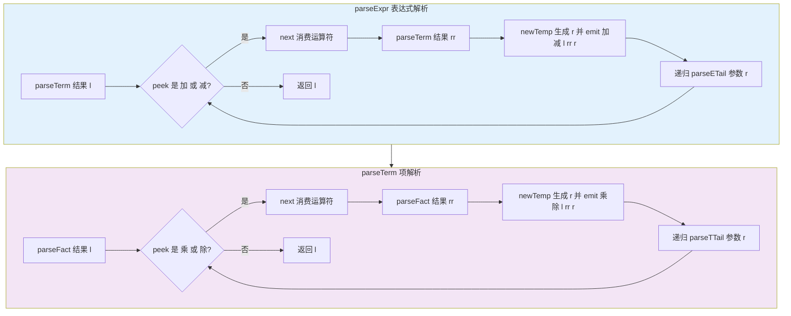
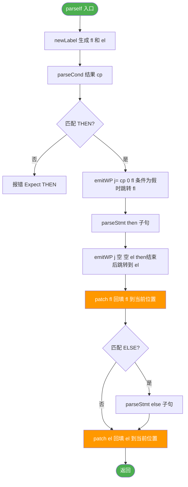
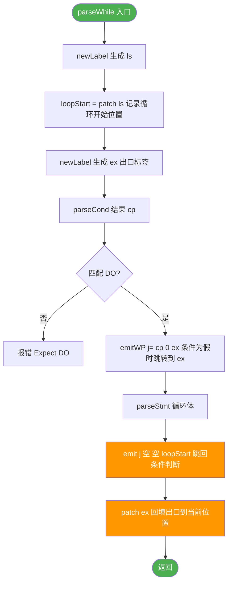
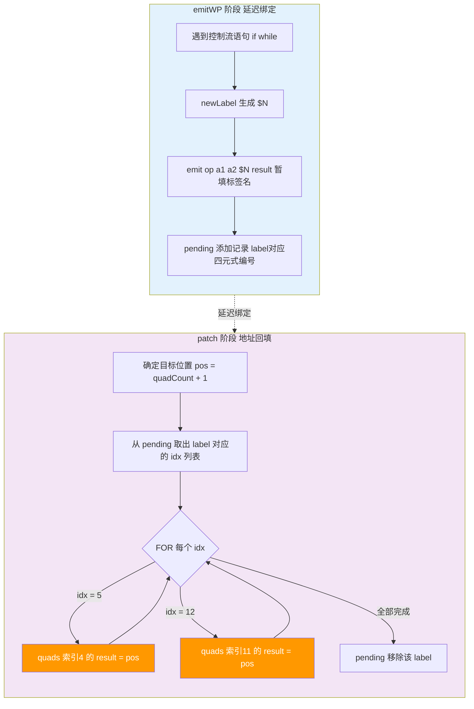
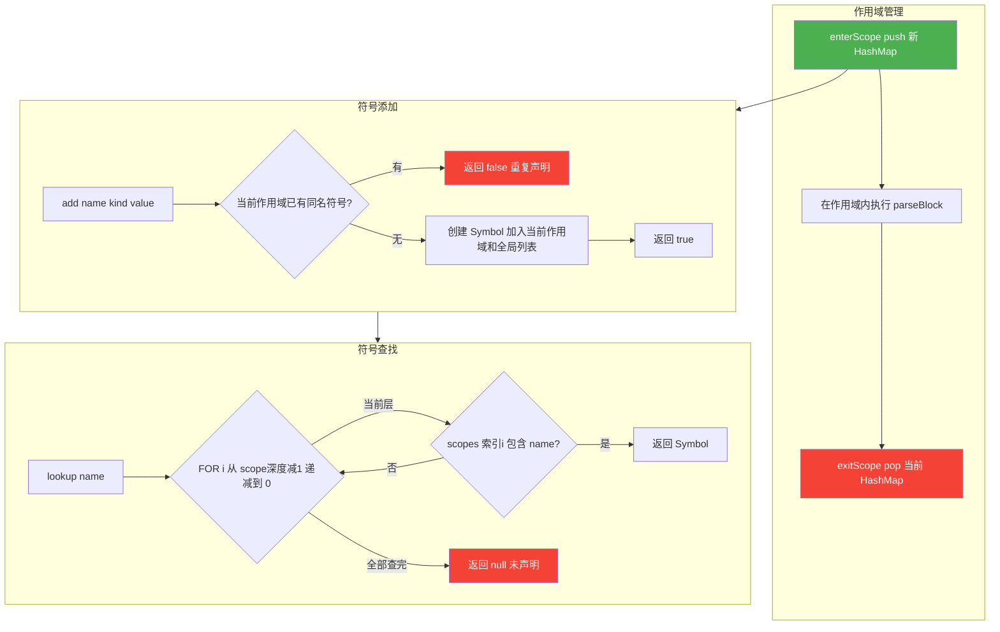
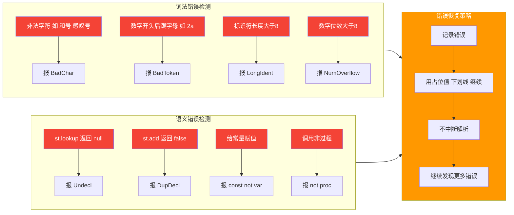
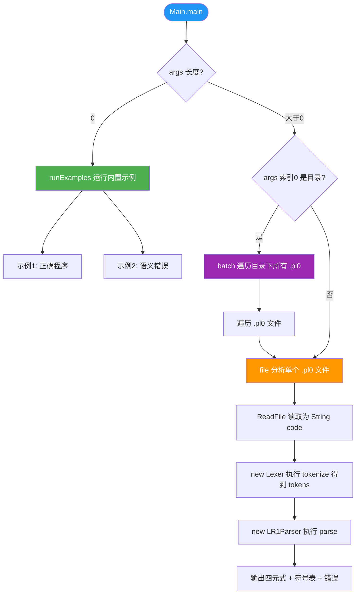

# 设计流程图

> 项目：PL0_SemanticAnalyzer_STranslation  
> 以下使用 Mermaid 绘制真实流程图（在支持 Mermaid 的 Markdown 编辑器中可直接渲染）

---

## 1. 总体架构流程

```mermaid
flowchart TD
    Start([开始]) --> Read[读取源代码 .pl0 文件]
    Read --> Lexer[词法分析 Lexer.tokenize]
    Lexer --> TokenStream[Token 流 + 词法错误]
    TokenStream --> Parser[语法+语义分析 LR1Parser.parse]

    subgraph ParserBlock[语法+语义分析 LR1Parser.parse]
        direction TB
        PD[递归下降解析] --> SA[语法制导翻译 S-Translation]
        SA --> QM[发射四元式 QuadrupleManager.emit]
        SA --> ST[管理符号表 SymbolTable]
    end

    ParserBlock --> Output[输出结果]
    Output --> Quads[四元式序列]
    Output --> SymTable[符号表]
    Output --> Errors[错误列表]
    Quads --> End([结束])
    SymTable --> End
    Errors --> End

    style Lexer fill:#4CAF50,color:#fff
    style ParserBlock fill:#2196F3,color:#fff
    style QM fill:#FF9800,color:#fff
    style ST fill:#9C27B0,color:#fff
```



---

## 2. 词法分析流程图



---

## 3. 递归下降语法分析流程图

### 3.1 总体解析树



### 3.2 表达式解析流程（消除左递归）



### 3.3 条件语句 if-then-else 流程



### 3.4 循环语句 while-do 流程



---

## 4. 四元式回填流程图



### 回填示例：if-then-else

```
源代码:  if a <= 10 then c := b + a else c := 0

四元式生成过程:
(1) syss
(2) <= a 10 T1
(3) j= T1 0 $1       ← emitWP: 条件为假时跳 $1
(4) + b a T2
(5) := T2 _ c
(6) j _ _ $2          ← emitWP: then 结束后跳 $2
    → patch($1): 将 $1 回填为 7  ← $1 = 当前位置
(7) = 0 _ c
    → patch($2): 将 $2 回填为 8  ← $2 = 当前位置
(8) syse
```

---

## 5. 符号表管理流程图



---

## 6. 错误处理流程



---

## 7. 主控流程



---

## 文档说明

以上流程图使用 **Mermaid** 语法绘制。在以下环境中可直接渲染查看：

| 环境 | 渲染方式 |
|------|---------|
| GitHub / GitLab | 直接支持 Mermaid 渲染 |
| VS Code | 安装 Markdown Preview Mermaid Support 插件 |
| Typora | 原生支持 |
| Obsidian | 安装 Mermaid 插件 |
| JetBrains IDE | 安装 Markdown 插件 |

若您的阅读环境不支持 Mermaid 渲染，请使用支持 Mermaid 的 Markdown 阅读器打开此文件。
